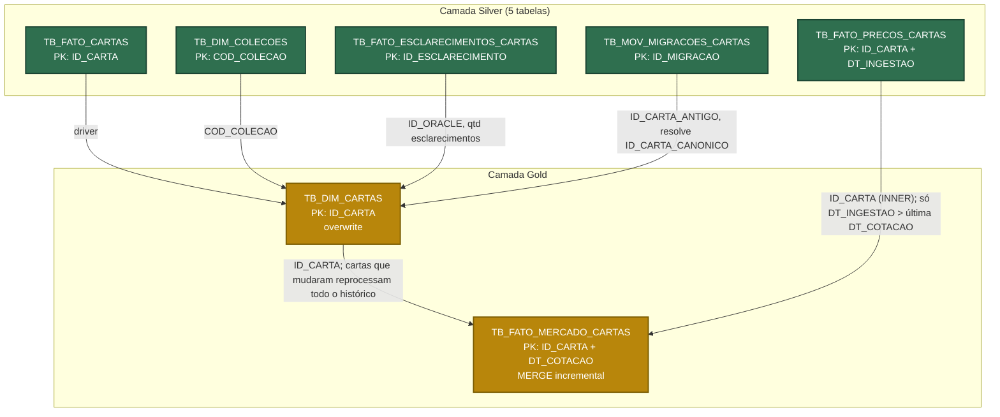

# Camada Gold

`TB_FATO_MERCADO_CARTAS` - visão de mercado de cartas de Magic: The Gathering pronta para consumo direto por analista, BI ou Genie, sem precisar conhecer Bronze/Silver. Tabela: preços da Silver x `TB_DIM_CARTAS` (atributos atuais da carta). A dimensão é regravada com overwrite; a fato é incremental (cotações novas + histórico das cartas que mudaram na dimensão), com `rebuild=true` para recalcular tudo. Ver [ADR-013](../../docs/ADR.md#adr-013--gold-incremental-com-propagação-da-dimensão).

- **Script:** `Dev/TB_FATO_MERCADO_CARTAS.py`
- **Utilitários:** `Dev/gold_utils.py` (config/extract/load/auditoria, mesmo padrão de `silver_utils.py`)
- **Comentários de negócio:** `Dev/gold_column_docs.py` (fonte única, aplicada via `COMMENT ON TABLE`/`ALTER COLUMN...COMMENT`)
- **Documentação:** [`Documentação/TB_FATO_MERCADO_CARTAS/Readme.md`](./Documentação/TB_FATO_MERCADO_CARTAS/Readme.md)

## Modelagem (Silver -> Gold)

`TB_FATO_MERCADO_CARTAS` usa as 5 tabelas Silver, via `TB_DIM_CARTAS`. A dimensão é regravada inteira (overwrite); a fato recebe MERGE só com as cotações novas e com o histórico das cartas que mudaram na dimensão. Carga completa na primeira run, se a dimensão mudar de colunas ou com `rebuild=true`.

Verde = alimenta a Gold.
